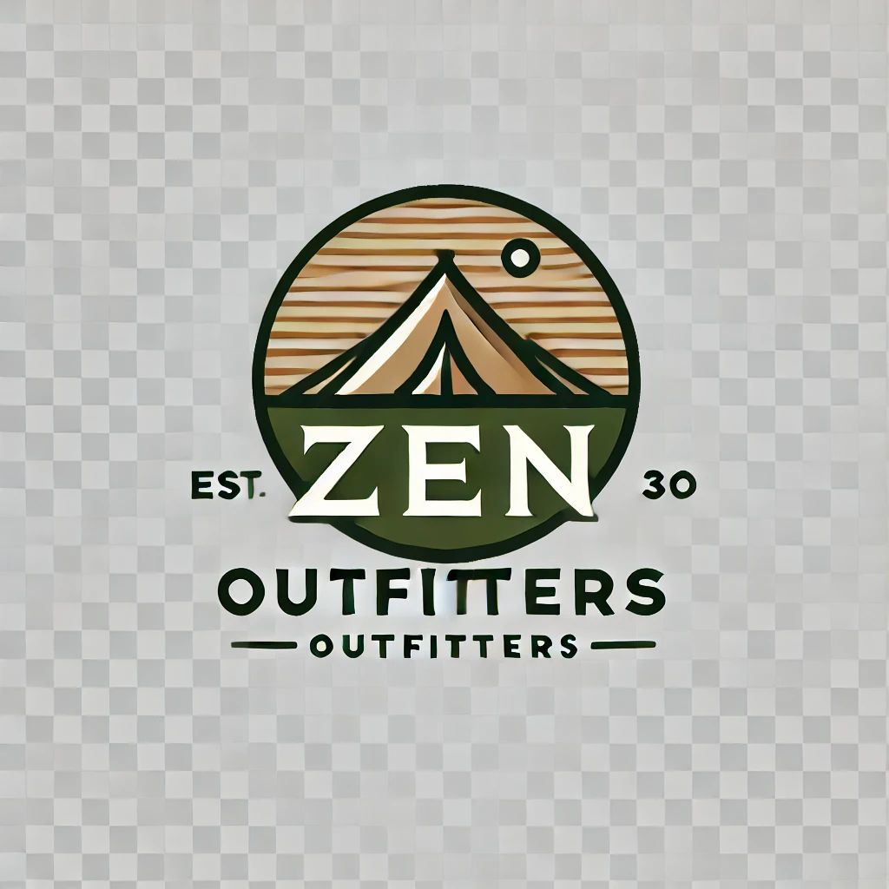
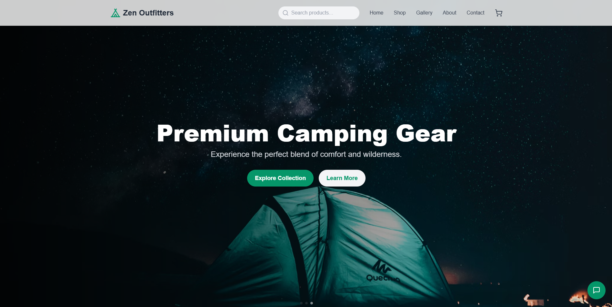
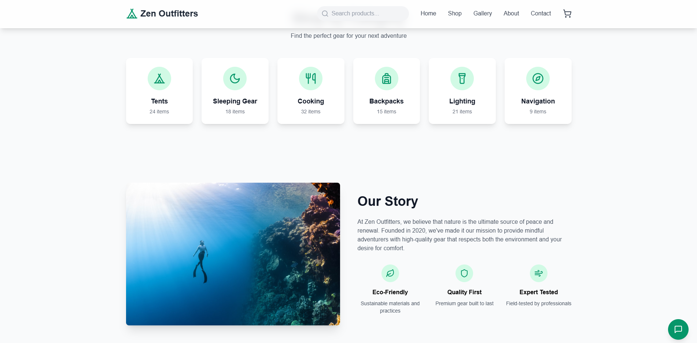
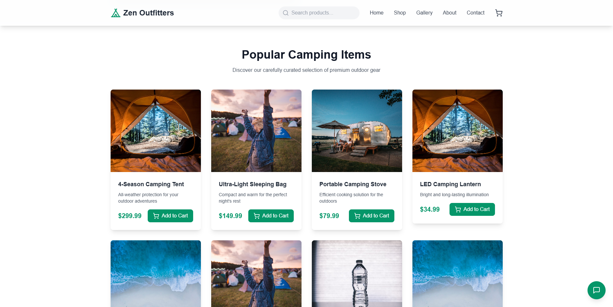
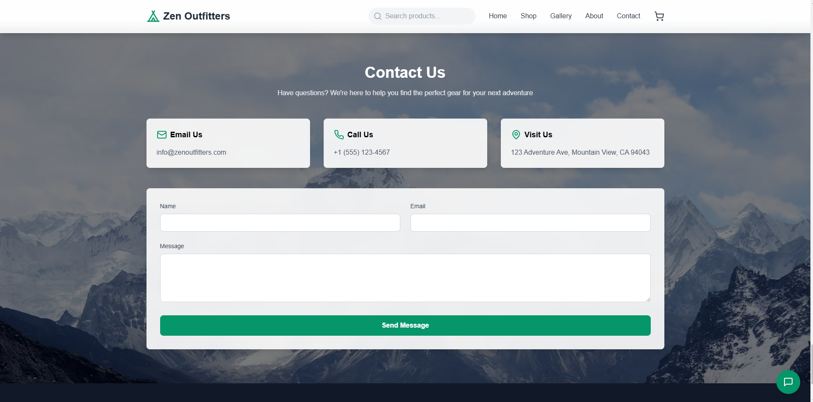

# 🌲 Zen Outfitters – Embrace the Wild! 🌄

Welcome to **Zen Outfitters** – your one-stop shop for premium camping gear that blends comfort and adventure. 🏕️ Whether you're exploring uncharted trails or setting up camp under the stars, we've got you covered with sustainable and top-notch outdoor equipment. 🛠️✨  



---

## 🌟 Key Features

### 🖥️ **Responsive Design**
- Perfectly optimized for **mobile**, **tablet**, and **desktop** devices.  
- Experience smooth navigation across all screen sizes.  

### 🎨 **Interactive Animations**
- Engaging animations powered by **Framer Motion** for an elevated user experience.  
- Dynamic sliders for showcasing products using **Swiper.js**.  

### 🌍 **Eco-Friendly Gear**
- Sustainably sourced materials that respect our planet. 🌱  

---

## 🚀 Getting Started

### Prerequisites  
Before you begin, ensure you have the following installed:  
- [Node.js](https://nodejs.org/) v14 or later  
- npm or yarn package manager  

### Installation  
1. Clone the repository:  
   ```bash
   git clone https://github.com/your-username/zen-outfitters.git
   cd zen-outfitters
   ```

2. Install dependencies:  
   ```bash
   npm install
   # or
   yarn install
   ```

3. Run the development server:  
   ```bash
   npm start
   ```
   Open your browser and visit [http://localhost:3000](http://localhost:3000) to explore! 🎉  

---

## 📂 Project Structure  

```plaintext
zen-outfitters/
├── public/               # Static assets (e.g., favicon, robots.txt)
├── src/
│   ├── assets/           # Images and icons
│   ├── components/       # Reusable React components
│   ├── pages/            # Application pages
│   ├── App.js            # Main app entry point
│   ├── index.js          # React DOM entry
│   └── styles/           # Custom styling (CSS or Tailwind)
├── package.json          # Project metadata and dependencies
└── README.md             # Documentation
```

---

## 🛠️ Scripts  

### `npm start`  
Launches the development server. The page reloads automatically on save.  

### `npm run build`  
Builds the app for production, creating an optimized version in the `build/` folder.  

### `npm test`  
Runs tests in interactive watch mode.  

---

## 🌐 Live Demo  
👉 **Check out the live website:** [Zen Outfitters](https://yourwebsite.com)  

---

## 🧰 Tools & Technologies  

- **React** ⚛️ – Dynamic UI building  
- **Tailwind CSS** 🎨 – Modern utility-first styling  
- **Framer Motion** ✨ – Stunning animations  
- **Swiper.js** 🔄 – Smooth sliders and carousels  

---

## 📸 Screenshots  

### 🖼️ **Home Page**  
  

### 🎇 **About Page**  
  

### 🛒 **Product Showcase**  
  

### 📱 **Contact Showcase**  
  

---

## 📤 Deployment  

1. Build the project:  
   ```bash
   npm run build
   ```
2. Deploy the contents of the `build` folder to your hosting platform:
   
   - [GitHub Pages]([https://pages.github.com/](https://imishan7.github.io/Zen-Outfitters-Hub/))  

---

## 📬 Connect With Us  

We'd love to hear from you! 💬  
- ** 🌎 WebSite:** [Ishan](https://ishand.netlify.app)  


---

## 🏷️ License  
This project is licensed under the **MIT License**. See the [LICENSE](LICENSE) file for details.  

---

### 🌟 Adventure Awaits! 🌟  
Ready to explore? Let's gear up with **Zen Outfitters** and embrace the great outdoors. 🌄  
